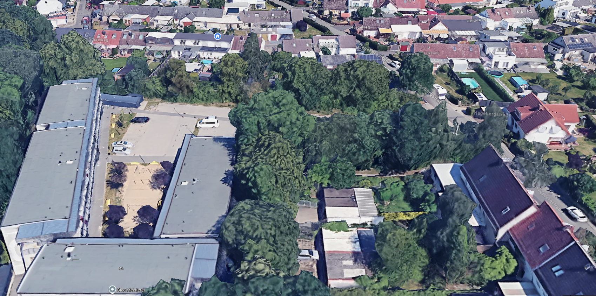

# EventMonitorAI Roadmap

Die Roadmap beschreibt die angestrebte Reihenfolge. Termine werden erst festgelegt, wenn Umfang und technische Risiken ausreichend geklärt sind.

## Phase 0 – Repository und Grundlagen

- [x] zentrale Projektstruktur
- [x] Architektur- und Entscheidungsdokumentation
- [x] Coding Guidelines und Contribution-Prozess
- [x] CI-Grundprüfung
- [x] Release-Workflow für saubere Quellcodepakete
- [x] einheitliche Versionierung aller Komponenten
- [x] reproduzierbare Entwicklungsumgebung

## Phase 1 – Stabile Ereigniserfassung

- [x] ESP32-S3 sendet Audio per UDP
- [x] Raspberry Pi verarbeitet Audiofenster
- [x] YAMNet-Klassifikation als Ausgangspunkt
- [x] FastAPI-Backend und Ereignisdatenbank
- [x] robuste Wiederverbindung und Paketverlustbehandlung
- [x] Geräteidentität, Health-Status und Telemetrie
- [x] nachvollziehbare Audiopegel-Kalibrierung über Dashboard mehrere Mikrofone gleichzeitig mit Angabe Referenzwert bei leisem mittleren und lauten Pegel

## Phase 2 – EventMonitor AudioLab

- [x] ZIP- und Ordnerimport
- [x] Dublettenprüfung
- [x] Audio-/dB-Segmentierung
- [x] manuelles Labeling und CSV-Export
- [x] Importprotokoll und Wiederaufnahme abgebrochener Imports
- [x] interaktiver dB-Verlauf, Spektrogramm und Segmentnavigation
- [x] variable Segmentgrenzen und Ereigniszuschnitt
- [x] Backup und Datenmigration

## Phase 3 – Lernende Klassifizierung

- [x] versionierte Feature- und Preprocessing-Pipeline
- [x] Trainings-, Validierungs- und Testaufteilung nach Aufnahmen
- [x] Basismodell und nachvollziehbare Qualitätsmetriken
- [x] Modellvorschläge mit Bestätigung/Korrektur
- [x] Active Learning für unsichere oder informative Beispiele
- [x] Audio-Embeddings und Ähnlichkeitssuche
- [x] Personen durch Lärm wie schreien, rufen identifizieren und klassifizieren - neue Personen anlegen die editierbar sind mit frei gewählten Namen - gesonderte Statistik je Personen, Beurteilungszeit, Lärmkategorie und Häufigkeit
- [x] lokale Modellverwaltung und Rollback

## Phase 4 – Ereignisse und Cases

- [x] einzelne Segmente zu zusammenhängenden Ereignissen verbinden
- [x] Schreien, Rufen und Impulse zeitlich gruppieren
- [x] Case-Modell mit Beginn, Ende, Dauer und Teilereignissen
- [x] Notizen, Bestätigungsstatus und revisionssichere Änderungshistorie
- [x] Lärmprotokoll als CSV und PDF
- [x] Ringpuffer im PSRAM
    2 Sekunden Audio vor dem Ereignis mit speichern
    Ereignistrigger
    WAV-Clip an den Pi übertragen

## Phase 5 – Dashboard und Integration

- [x] Kalender, Timeline, Heatmaps und Statistiken
- [x] Live-Ereignisansicht
- [x] Home-Assistant-Integration
- [x] Benachrichtigungsregeln
- [x] PostgreSQL-Option und Mehrgerätebetrieb
- [x] Rollen, Authentifizierung und Zugriffsschutz

## Phase 6 – Dashboard Erweiterungen

  - [x] Mikrofon Verwaltung - Namen, Position, Aktiv/Inaktiv, Kalibrierung
  - [x] Live-Soundausgabe je Mikrofon anwählbar und pro User durch Admin freizugeben, ohne Freigabe Funktion nicht sichtbar beim User
- [ ] Karte Bild für Positionierung der Mikrofone und Darstellung von Messergebnissen  Die Mikrofone sollen auf dem Bild positioniert werden und Messergebnisse und Anzahl Überschreitungen darstellen, zusäzlich Erstellung einer Heatmap der Schallpegelausbreitung
- [ ] Bereitstellung einer Progressive Web App mit Pushnachrichten bei Lärmereignissen mit Bestätigung oder Ablehnungsbutton als Antwort - Antwort mit Angabe User, Ereignis ID speichern und als Zeuge in Lärmprotokoll einbinden
- [ ] Darstellung der letzten 5 Ereignisse
- [ ] Rollen, Authentifizierung und Zugriffsschutz

## Phase 7 - KI

Gilt für die Live Analyse wie Audi-Lab

Ein Modell wie YAMNet kann allgemeine Klassen erkennen, zum Beispiel:
Schreien oder Rufen
Autohupe
Hund
Musik
Motor
Sirene
Schlag- oder Aufprallgeräusch
Menschenmenge

Zusätzlich manuell und dadurch erlernte Klassen wie:

Fußball gegen Betonwand
Fußball gegen Metallhütte
Schlagen gegen Laternen
konkrete Art des Aufpralls

Dafür eigene Beispiele sammeln und einen Klassifikator nachtrainieren.
Eine Verwaltung für das Pflegen von Klassen im Dashboard Administrator-Einrichtung bereitstellen
Im Protokoll würden wir zunächst beispielsweise speichern:
Primärklasse: Impact / Schlaggeräusch
Sicherheit: 91 %
Unterklasse: Fußball gegen Metall
Status: manuell zugeordnet
Durch die Bestätigungen bauen wir gleichzeitig Trainingsdaten für die spätere automatische Unterklasse auf.
manuelle Korrektur für das Lärmprotokoll

Wir bauen zum Start zwei Ebenen:

1. Automatische Basisklasse
    Hupen
    Rufen/Schreien
    Schlag/Aufprall
    Musik
    Hund
    Motor
    Sirene
    Vögel
    Maschinen
    Fahrzeuge
2. Manuelle Feinzuordnung
    Fußball gegen Beton
    Fußball gegen Metall
    Schlagen gegen Laterne
    anhaltendes Rufen
    Fahrzeughupen
    sonstiger Lärm
So bekommst du früh ein brauchbares Lärmprotokoll, ohne dass wir dir falsche Präzision vortäuschen.

## Phase 8 – ## Audio-Lab

https://github.com/DEV-BR77/EventMonitorAI/tree/main/tools/audio-lab

Mit in Dashboard einbinden
Klassen per Kacheln direkt auswählbar für die Zuweisung und Bestätigung
Darstellung Anzahl offener und erledigter Ereignisse gegliedert nach unbekannt oder erkannter Klasse durch die KI
Prüfung und Bestätigung je Klasse durchführbar um in einem Rutsch identische Klassen zu bestätigen
Automatisierte Überprüfungsläufe um neue Zuweisungen für das Erlernen und zuweisen zu nutzen
Nächtlicher Prüflauf um bereits bestätigte Ereignisse zu verbessern oder die Personenerkennung zu überarbeiten.
Unterbrechung und Fortsetzung von den Überarbeitungen

## Gliederung der Beurteilungszeiten, Zuschläge und Referenzwerte

- Die Immissionsrichtwerte und Zeiten:

    1. Tag 50 dB(A)

        06.00 – 13.00 Uhr
        15:00 - 19:00 Uhr

    2. Abend 35 dB(A)

        19.00 – 22.00 Uhr

    3. Nacht 35 dB(A)

        22.00 – 06.00 Uhr

- Zuschlag für Tageszeiten mit erhöhter Empfindlichkeit

    Für folgende Zeiten ist bei der Ermittlung des Beurteilungspegels die erhöhte Störwirkung von Geräuschen durch einen Zuschlag von 6 dB zu berücksichtigen:

    1. an Werktagen

        06.00 – 07.00 Uhr
        20.00 – 22.00 Uhr

    2. an Sonn- und Feiertagen

        06.00 – 09.00 Uhr
        13.00 – 15.00 Uhr
        20.00 – 22.00 Uhr

## Phase 9 - Produktreife

- [ ] Installationspakete und Upgrade-Strategie
- [ ] automatisierte Backups und Aufbewahrungsregeln
- [ ] Performance- und Langzeittests
- [ ] Security- und Datenschutzreview
- [ ] dokumentierte Release-Kriterien für v1.0
