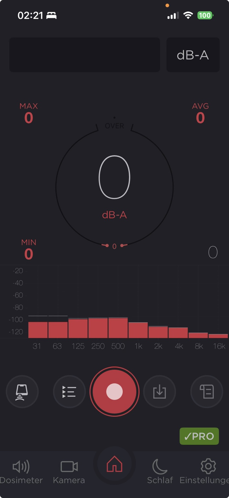

# Mobile Dashboard – UI-Referenz

Status: verbindliche Orientierung für die Implementierungsphase Dashboard  
Zielplattformen: Android und iOS  
Bereich: EventMonitorAI / ELM-Protokoll

## Ziel

Das mobile Dashboard stellt die aktuelle Schallmessung als zentrale Arbeitsansicht dar. Die beigefügte Referenzaufnahme einer Schallpegel-App dient ausschließlich als Orientierung für Informationshierarchie, Bedienbarkeit und dunkles Erscheinungsbild. EventMonitorAI erhält ein eigenständiges Design und übernimmt keine geschützten Markenelemente oder eine pixelgenaue Kopie.

## Visuelle Referenz

> Externe Layout-Referenz. Ausschließlich als Orientierung für Informationshierarchie und Bedienkonzept verwenden.

## Aufbau der Hauptansicht

1. **Kopfbereich**
   - Name des aktiven Messpunkts beziehungsweise Sensors
   - Verbindungsstatus
   - Auswahl der Bewertungsart, zunächst `dB(A)`
   - optionaler Kalibrierstatus

2. **Live-Messung**
   - sehr große Anzeige des aktuellen Pegels in `dB(A)`
   - gut sichtbare Werte für `MIN`, `MAX` und `AVG`
   - farbliche Pegelzonen ohne alleinige Abhängigkeit von Farbe
   - Kennzeichnung einer Grenzwertüberschreitung

3. **Frequenzspektrum**
   - Frequenzbänder von 31 Hz bis 16 kHz
   - Live-Balken oder Verlauf
   - klare Achsen- und Einheitenbeschriftung
   - Darstellung muss bei fehlenden Daten einen eindeutigen Leerzustand zeigen

4. **Messsteuerung**
   - zentraler Start-/Stopp-Button
   - sichtbarer Zustand: bereit, läuft, pausiert, gestoppt oder Fehler
   - Laufzeit der aktuellen Messung
   - Schutz gegen unbeabsichtigtes Beenden einer laufenden Protokollierung

5. **Schnellaktionen**
   - Ereignisliste öffnen
   - Markierung beziehungsweise Notiz zum aktuellen Ereignis erfassen
   - Foto oder Video als optionalen Kontext hinzufügen
   - Export beziehungsweise Freigabe des ausgewählten Protokolls

6. **Untere Navigation**
   - Live
   - Ereignisse
   - ELM-Protokoll
   - Auswertung
   - Einstellungen

## EventMonitorAI-spezifische Ergänzungen

Direkt unterhalb oder innerhalb der Live-Messung wird die aktuelle KI-Klassifizierung angezeigt:

- erkannte Ereignisklasse, zum Beispiel Stimmen, Streit, Türknallen, Hund, Fahrzeug oder Musik
- Konfidenzwert
- Beginn und bisherige Dauer
- Status `unbestätigt`, `bestätigt` oder `verworfen`
- Möglichkeit zur manuellen Korrektur

Für das ELM-Protokoll werden mindestens gespeichert:

- Datum und Uhrzeit
- Messpunkt und Sensor
- Dauer
- aktueller, minimaler, maximaler und durchschnittlicher Pegel
- Bewertungsart
- erkannte und bestätigte Ereignisklasse
- Grenzwertüberschreitung
- Benutzerkommentar
- optionale Audio-, Foto- oder Videoreferenz
- technische Qualitäts- und Kalibrierhinweise

## Darstellungsregeln

- Dark Mode als primäre Referenz, Light Mode später ergänzen
- hoher Kontrast und ausreichend große Touch-Flächen
- gleiche Informationsarchitektur auf Android und iOS
- plattformspezifische Navigation, Berechtigungsdialoge und Bedienkonventionen respektieren
- keine Aussagekraft vortäuschen: Bei gestoppter Messung oder fehlendem Sensor keine scheinbar gültigen Nullwerte anzeigen
- KI-Ergebnisse immer als Vorschläge kenntlich machen
- Datenschutzstatus und lokale beziehungsweise entfernte Verarbeitung transparent darstellen

## Zustände, die im Template vorgesehen werden müssen

| Zustand | Darstellung |
|---|---|
| Keine Sensorverbindung | Verbindungsfehler mit Wiederholen-Aktion |
| Bereit | Messwerte als Strich, nicht als gültige Null |
| Messung läuft | Live-Pegel, Laufzeit und aktiver Stopp-Button |
| Grenzwert überschritten | deutlicher Hinweis mit Zeitstempel |
| KI-Ereignis erkannt | Klasse und Konfidenz als Vorschlag |
| Datenlücke | markierter Zeitraum ohne interpolierten Messwert |
| Messung beendet | Zusammenfassung und Aktion zum ELM-Protokoll |

## Abgrenzung für die erste Dashboard-Implementierung

Für den ersten funktionsfähigen Stand genügen:

- Sensorstatus
- aktueller dB(A)-Wert
- MIN, MAX und AVG
- einfaches Frequenzspektrum
- Start-/Stopp-Steuerung
- aktuelle KI-Klasse mit Konfidenz
- Navigation zur Ereignisliste und zum ELM-Protokoll

Historische Diagramme, Kamera, Exporte und erweiterte Auswertungen folgen iterativ.
